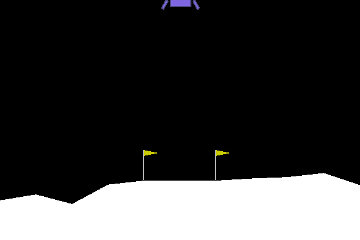

This repository contains a Python module and test code for running the Asynchronous Adavantage Actor Critic (A3C) algorithm 
for Deep Reinforcement Learning.  After reading Raymond Yuan's excellent A3C
[tutorial](https://medium.com/tensorflow/deep-reinforcement-learning-playing-cartpole-through-asynchronous-advantage-actor-critic-a3c-7eab2eea5296),
I adapted his [CartPole code](https://github.com/tensorflow/models/blob/master/research/a3c_blogpost/a3c_cartpole.py) as follows:

1. Translated the code to TensorFlow 2.0.

2. Added support for games other than CartPole.

3. Made it a Python package.

## Prerequisites

(On Linux, you should run the following commands using sudo.)

First you'll want to make sure your Python package installer (pip) is up-to-date, so that you get TensorFlow 2.0
instead of an earlier version:

```pip3 install --upgrade pip```

Next install TensorFlow 2.0:

```pip3 install tensorflow```

(Because the A3C algorithm uses CPU parallelism rather than GPU, I did not install tensorflow-gpu for this project.)

Finally, install the [OpenAI Gym](https://gym.openai.com) package with support for Box2D:

```pip3 install gym[box2d]```

If you're running Windows 10 and can't install gym that way, you can either do a 
[more complicated](https://medium.com/@sayanmndl21/install-openai-gym-with-box2d-and-mujoco-in-windows-10-e25ee9b5c1d5)
install, or opt out of the Box2D support:

```pip3 install gym```

Without Box2D I was able to run the default CartPole example, but not LunarLander.

## Getting started

The easiest way to get started is to run the default training and testing examples:

```python3 run-a3c.py --train```

This will train on 1000 episodes of the [Cart Pole v0](https://github.com/openai/gym/wiki/CartPole-v0) game. To see how well your training went,
you can do

```python3 run-a3c.py```

